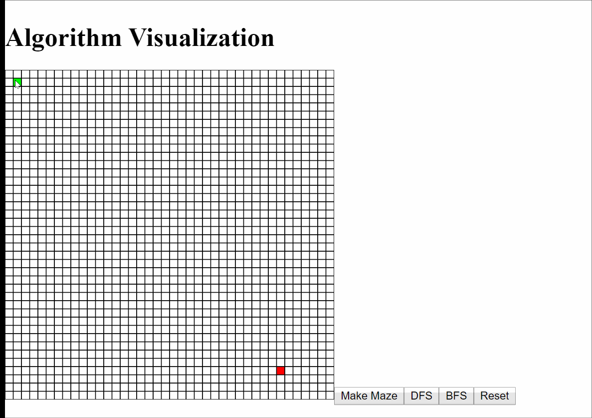
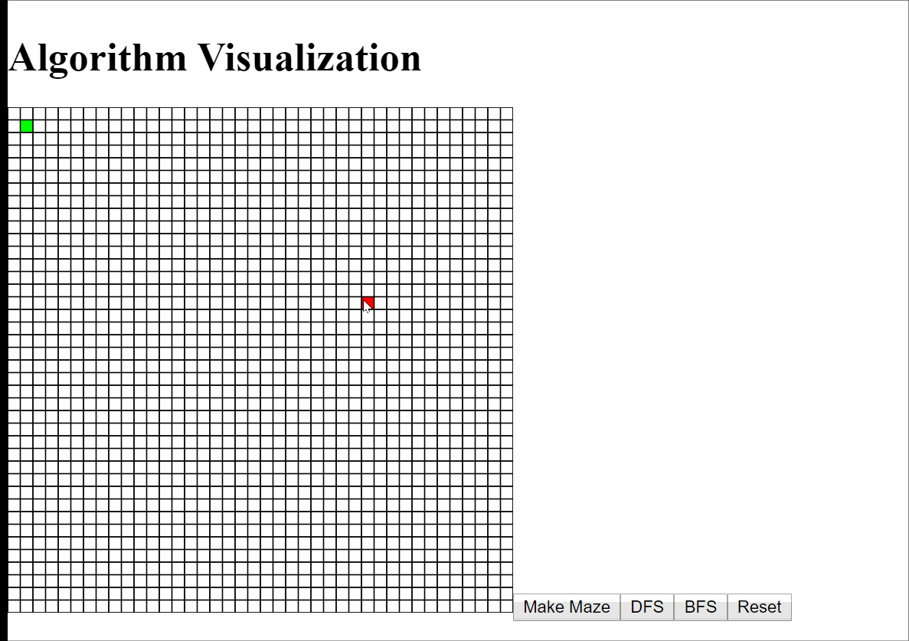
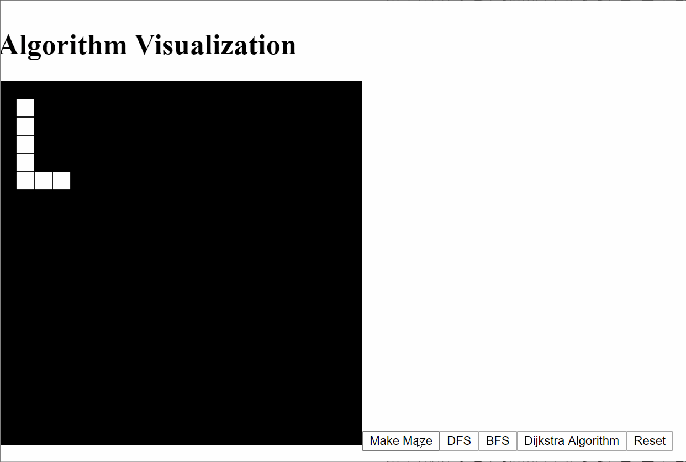
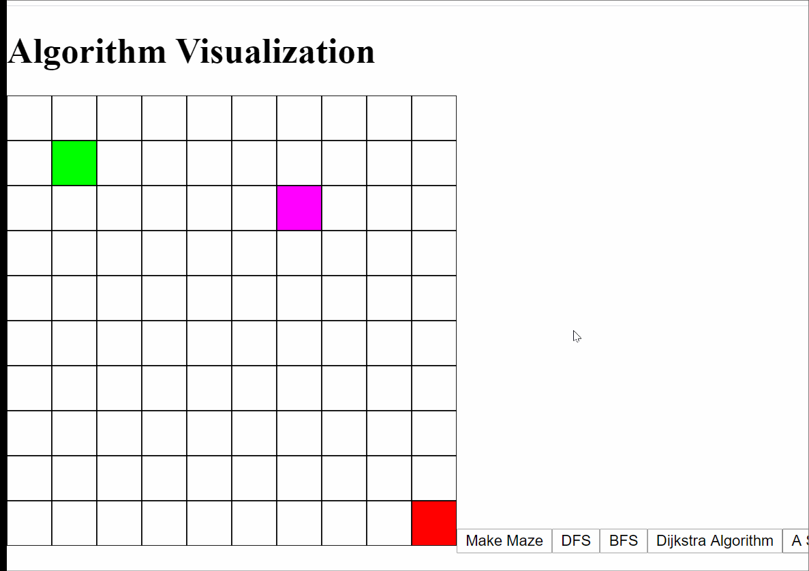
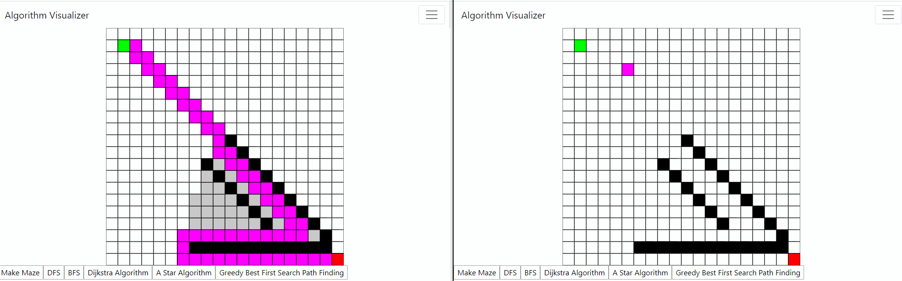
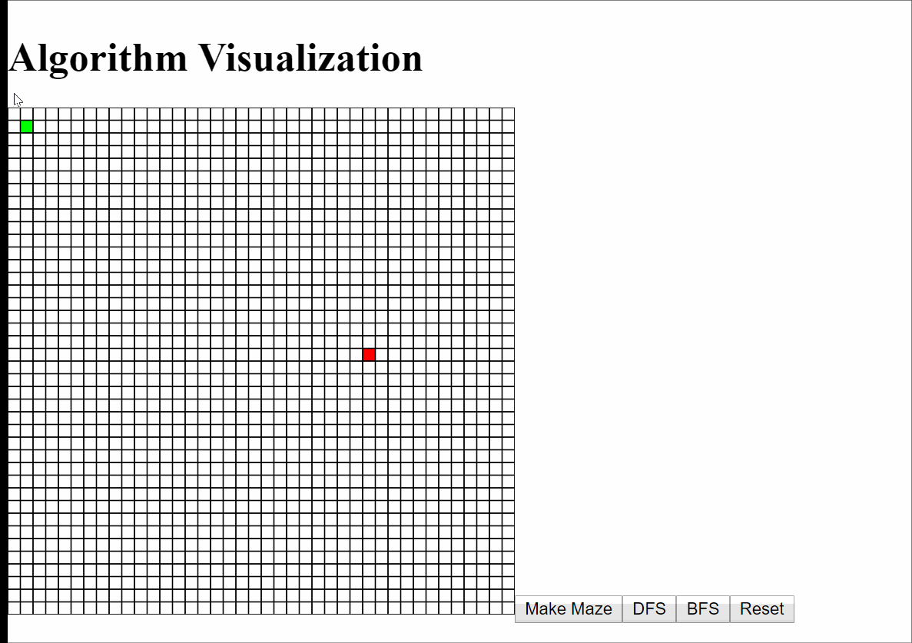

# Pathfinding Algorithm

## Description:

​	A web application allow users to see how different algorithms play out. Currently working on adding more algorithms.

## Maze Generation:

- Uses depth-first search recursive backtracking.

## DFS

See how depth first search algorithm searches for the target cell. It doesn't find the shortest path. Its merely a visualization of how depth first search may look.

## Breadth First Search

Same as depth first search. Breadth first search merely finds the target cell, not the shortest path to it. You can see how DFS and BFS is different from one another based on how the algorithm searches. 

## Dijkstra's Shortest Path Algorithm

Dragging the target cell around and constantly updating the shortest path to that cell was an accident. I realized that this is only possible because dijkstra's shortest algorithm finds the shortest path from the start cell to every cell. Pretty neat huh. 

If I just wanted the target cell alone. I would terminate the algorithm once the target cell is found. 

## A* Search

Notice how A star search is searching towards the target cell. Thats becuase A star is an informed search algorithm. It uses a heuristic based on the current cell's distance to the target cell. Meaning A star will always choose the next best cell to search based on this heuristic. A star is similar to Dijkstra's algorithm minus the informed portion.

## Greedy Best First Search

To the left is Greedy Best First Search, to the right is A* Search. Greedy BFS uses a heuristic just like A*, but the only difference is that it merely chooses the next best step at the given location. It doesn't consider the other paths unlike A\* search. A\* on the other hand chooses the distance from the start node to the next plus (the next node to the target node) ~ f(n) = g(n) + h(n). A\* search will always pick the shortest f(n) solution to the goal. 

## Interactivity

There are a lot of bugs that need to worked out here. 