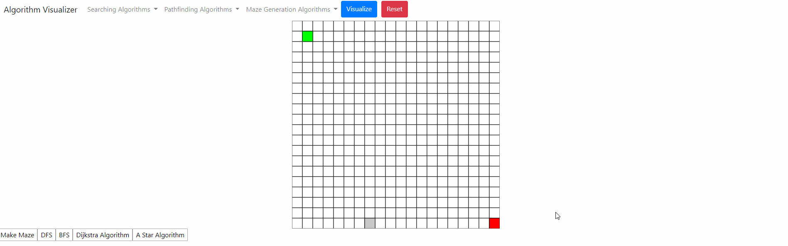

### Pathfinding Algorithm

#### Description:

​	Right now, there's only depth first search algorithm. Maze generation uses depth-first search recursive backtracker. 

#### Maze Generation:

- Uses depth-first search recursive backtracking.

#### DFS

#### Breadth First Search

#### Dijkstra's Shortest Path Algorithm

Dragging the target cell around and constantly updating the shortest path to that cell was an accident. I realized that this is only possible because dijkstra's shortest algorithm finds the shortest path from the start cell to every cell. Pretty neat huh. 

If I just wanted the target cell alone. I would terminate the algorithm once the target cell is found. 

#### I plan on adding some interactivity

